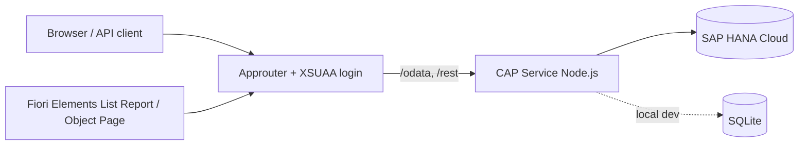

# SAP BTP Entitlement Service

A portfolio-grade **SAP Cloud Application Programming (CAP)** application for managing
SAP BTP **entitlements**, **products** and **consumption records** — with server-side
business logic, an OData V4 service, a REST facade, a Fiori Elements UI, and a full
Cloud Foundry deployment to SAP BTP backed by SAP HANA Cloud.


> Built and deployed end to end: verified locally on SQLite and running live on SAP BTP
> (Cloud Foundry + HANA Cloud) behind an approuter with XSUAA authentication.

---

## What it does

The app models how a subaccount is granted a **quota** of a **product** under a commercial
**plan**, records **consumption** against that entitlement, and enforces quota, validity
and status rules on the server:

- Reject a consumption booking that would exceed the remaining quota.
- Reject consumption dated outside the entitlement's validity window.
- Reject consumption against a `SUSPENDED` / `EXPIRED` entitlement.
- Compute `consumedQuota` / `remainingQuota` on the fly and colour the UI by criticality.
- Default status, unit and usage date.

## Architecture



## Domain model

```
Products 1 ──< Entitlements 1 ──*> ConsumptionRecords
             (association)      (composition)
```

- **Products** — master data for services that can be entitled and consumed
  (SAP HANA Cloud, Application Runtime, Object Store, Integration Suite, AI Core).
- **Entitlements** — grant a subaccount a quota of a product under a plan, valid between
  `validFrom`/`validTo`, with a status (`DRAFT`/`ACTIVE`/`SUSPENDED`/`EXPIRED`).
  Has an **association** to Product and a **composition** of ConsumptionRecords, plus
  computed `consumedQuota`, `remainingQuota`, `statusCriticality`.
- **ConsumptionRecords** — individual usage bookings (`usageDate`, `amount`, `unit`,
  `region`, `note`); child of the composition.

Both root entities use `cuid` (UUID keys) and `managed` aspects from `@sap/cds/common`.

## Services & endpoints

| Service | Protocol | Path |
|---|---|---|
| `EntitlementService` | OData V4 (draft-enabled) | `/odata/v4/entitlement` |
| `EntitlementRestService` | REST | `/rest/entitlement` |

Bound actions on `Entitlements`: `recordConsumption(amount, usageDate, region, note)`
(quota-enforced) and `recomputeQuota()`.

## Tech stack

CAP (`@sap/cds` 8) · Node.js · OData V4 + REST · SAP HANA Cloud (prod) / SQLite (dev) ·
Fiori Elements (UI5, `sap.fe.templates`) · Cloud Foundry MTA · XSUAA · Approuter.

---

## Run locally (SQLite)

```bash
npm install
npx cds deploy --to sqlite:db/entitlements.db
CDS_REQUIRES_AUTH_KIND=dummy npx cds watch
```

Open:

- OData: <http://localhost:4004/odata/v4/entitlement/>
- Metadata: <http://localhost:4004/odata/v4/entitlement/$metadata>
- REST: <http://localhost:4004/rest/entitlement/Products>
- Fiori app: <http://localhost:4004/entitlements/webapp/index.html>

Run the smoke tests (starts the server and exercises every endpoint and validation handler):

```bash
bash test/smoke-tests.sh
```

### Validation examples

```bash
# Book within quota via the bound action  -> 200
curl -X POST ".../Entitlements(ID=<id>,IsActiveEntity=true)/EntitlementService.recordConsumption" \
     -H "Content-Type: application/json" -d '{"amount":30,"usageDate":"2025-05-01"}'

# Exceed the quota -> 409 rejected
curl -X POST ".../rest/entitlement/Consumptions" \
     -H "Content-Type: application/json" -d '{"entitlement_ID":"<id>","amount":500}'
```

## Deploy to SAP BTP (Cloud Foundry + HANA Cloud)

```bash
npm install
mbt build
cf deploy mta_archives/sap-btp-entitlement-service_1.0.0.mtar
```

Prerequisites: CF CLI + `multiapps` plugin, `mbt`, a running HANA Cloud instance, and
entitlements for `hana` (hdi-shared), `xsuaa`, and (optional) `html5-apps-repo`.
The `mta.yaml` deploys the CAP service, the HANA HDI deployer, and the approuter, wiring
in the XSUAA and HANA services.

> **Live deployment:** this project was deployed and verified on an SAP BTP trial —
> approuter → XSUAA login → CAP service → HANA Cloud, serving the seeded entitlements
> with computed remaining quota.

## Runtime dependencies for BTP/HANA (important)

When the production profile targets HANA, the service needs these at runtime (already in
`package.json`):

- `@sap/hana-client` — HANA driver (else: *Neither "hdb" nor "@sap/hana-client" could be found*).
- `@sap/xssec` — XSUAA/JWT validation for the `authenticated-user` restriction
  (else: *MODULE_NOT_FOUND .../auth/xssec.js*).

`xs-security.json` includes an `oauth2-configuration.redirect-uris` allow-list for the
approuter host — adjust the region wildcard (`*.cfapps.<region>.hana.ondemand.com`) to
your landscape.

Stop / start the trial HANA instance from the CLI (no HANA Cloud Tools subscription needed):

```bash
echo {"data":{"serviceStopped":true}}  > stop.json  && cf update-service entitlement-hana -c stop.json
echo {"data":{"serviceStopped":false}} > start.json && cf update-service entitlement-hana -c start.json
```

## Project structure

```
db/schema.cds                 data model (entities, associations, composition)
db/data/*.csv                 seed data (one file per entity)
srv/service.cds               OData V4 service + REST service + actions
srv/service.js                custom handlers (validation, quota, defaults)
app/annotations.cds           Fiori Elements UI annotations
app/entitlements/webapp/      Fiori Elements List Report / Object Page app
app/router/                   approuter (xs-app.json)
mta.yaml                      Cloud Foundry multi-target app descriptor
xs-security.json              XSUAA scopes / roles / redirect-uris
test/smoke-tests.sh           end-to-end endpoint + validation checks
```

## License

Apache-2.0 — see [LICENSE](./LICENSE).
